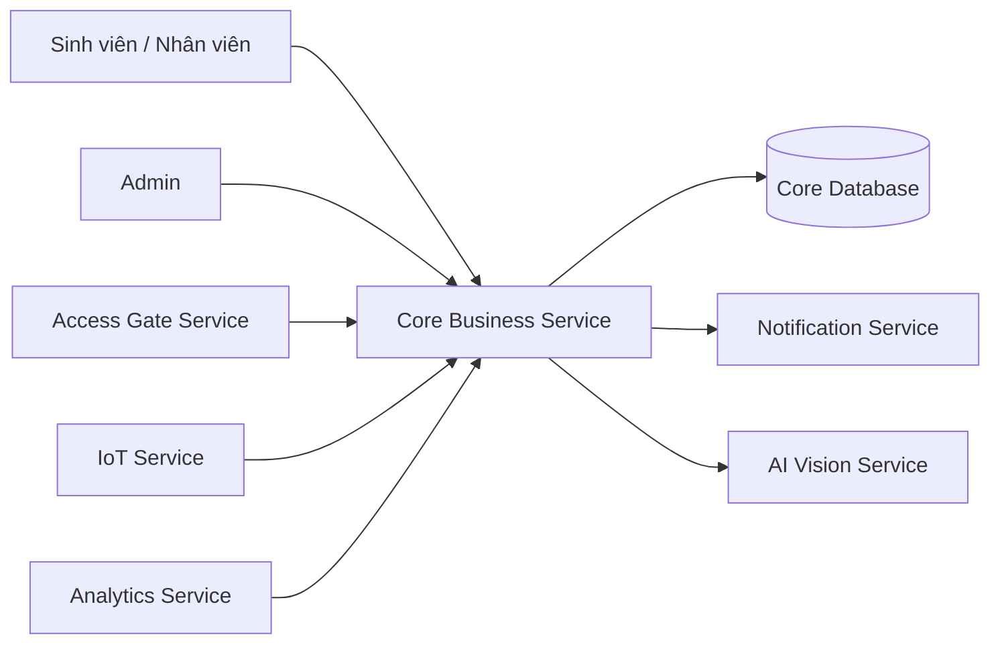

# Service Boundary của nhóm

## 1. Thông tin nhóm

- Tên nhóm: A6 - nhóm a
- Lớp: FIT4110
- Thành viên: Phạm Hoàng Anh, Trần Quang Huy, Nguyễn Trọng Nam
- Service nhóm phụ trách: Core Business Service
- Sản phẩm tổng thể của lớp: Smart Campus Platform

## 2. Actor

- Sinh viên / Giảng viên / Nhân viên (người dùng cuối gửi yêu cầu nghiệp vụ)
- Các service khác trong hệ thống (AI Vision, Access Gate, Notification, Analytics)
- Admin hệ thống

## 3. System Boundary

Nhóm em xây phần nào? **Core Business Service — xử lý nghiệp vụ trung tâm của Smart Campus**

Phần nhóm kiểm soát:
- Xử lý logic nghiệp vụ trung tâm (đăng ký, phân quyền, quản lý sự kiện)
- REST API cung cấp cho các service khác
- Cơ sở dữ liệu nghiệp vụ của Core

Phần nhóm chỉ tích hợp:
- Nhận kết quả nhận diện từ AI Vision Service
- Gửi thông báo qua Notification Service
- Nhận dữ liệu IoT từ IoT Service

## 4. Service Boundary

Service của nhóm có trách nhiệm gì?
- Tiếp nhận và xử lý các yêu cầu nghiệp vụ từ người dùng và service khác
- Quản lý trạng thái, phân quyền, điều phối luồng nghiệp vụ
- Cung cấp REST API cho Consumer (AI Vision, Access Gate, Analytics)

Service KHÔNG làm gì?
- Không xử lý nhận diện hình ảnh (thuộc AI Vision)
- Không điều khiển thiết bị vật lý (thuộc IoT)
- Không gửi thông báo trực tiếp đến người dùng (thuộc Notification)

## 5. Input / Output

### Input
- Yêu cầu nghiệp vụ từ người dùng (HTTP Request)
- Kết quả xử lý từ AI Vision Service
- Sự kiện từ Access Gate Service
- Dữ liệu cảm biến từ IoT Service

### Output
- Phản hồi kết quả xử lý nghiệp vụ (HTTP Response)
- Yêu cầu gửi thông báo đến Notification Service
- Dữ liệu nghiệp vụ cho Analytics Service

## 6. API dự kiến

| Method | Endpoint | Mục đích |
|---|---|---|
| GET | /health | Kiểm tra service |
| GET | /api/v1/users/{id} | Lấy thông tin người dùng |
| POST | /api/v1/events | Tạo sự kiện nghiệp vụ mới |
| GET | /api/v1/events | Lấy danh sách sự kiện |
| PUT | /api/v1/events/{id} | Cập nhật sự kiện |
| DELETE | /api/v1/events/{id} | Xoá sự kiện |
| POST | /api/v1/access/verify | Xác minh quyền truy cập |

## 7. Phụ thuộc service khác

Service này gọi đến service nào?
- **Notification Service** — gửi thông báo khi có sự kiện nghiệp vụ
- **AI Vision Service** — yêu cầu nhận diện khuôn mặt/đối tượng

Service nào gọi đến service này?
- **Access Gate Service** — xác minh quyền ra vào
- **Analytics Service** — lấy dữ liệu nghiệp vụ để phân tích
- **IoT Service** — báo cáo sự kiện cảm biến

## 8. Sơ đồ minh họa

